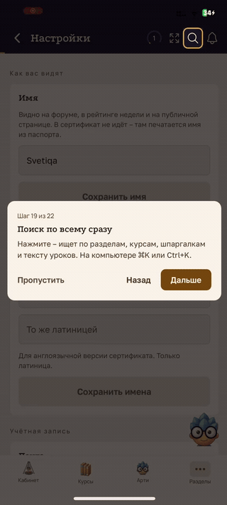

# BUG-003 — На шаге 20 онбординга отсутствует кнопка «Дальше»

**Краткое описание:** шаг 20 обучающего тура не содержит кнопки «Дальше» и сменяется шагом 21 автоматически

**Окружение:** iOS (iPhone); версия приложения не зафиксирована
**Severity:** Major
**Priority:** Medium
**Дата:** 24.09.2026
**Статус:** открыт

---

## Шаги воспроизведения

1. Пройти обучающий тур до шага 20
2. Осмотреть карточку подсказки
3. Не выполнять никаких действий

## Ожидаемый результат

Карточка шага 20 содержит тот же набор кнопок, что и остальные шаги тура: «Пропустить», «Назад», «Дальше». Переход к шагу 21 происходит по нажатию.

## Фактический результат

Кнопка «Дальше» в карточке отсутствует. Переход к шагу 21 выполняется сам, без действий пользователя.

## Вложения

*Та же запись, что в BUG-002*

Отдельной записи шага 20 нет: он проскакивает быстрее, чем успевает сработать запись.

## Примечания

Пользователь теряет контроль над темпом прохождения: если он не успел прочитать текст, вернуться можно только кнопкой «Назад», которая при этом остаётся на месте.

Тот же характер, что у [BUG-001](BUG-001-onboarding-step2-skipped.md) — автоматическая смена шага без действия. Разница в том, что здесь кнопка отсутствует в разметке, а на шаге 2 она есть, но не успевает сработать. Возможно, один корень: часть шагов помечена как «информационные» и переключается по таймеру.
