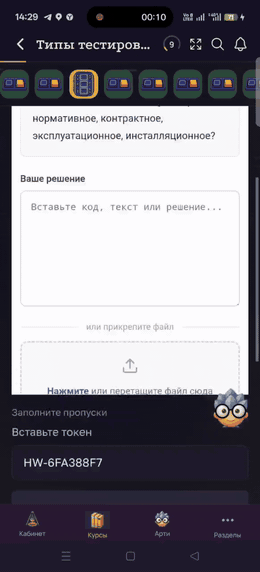

# BUG-006 — Не прокручивается встроенное окно задания с ИИ-проверкой

**Краткое описание:** содержимое встроенного окна задания с проверкой через ИИ не прокручивается, задание невозможно выполнить

**Окружение:** OPPO Reno 14F (CPH2743), ColorOS 15.0.2.610(EX01); версия приложения не зафиксирована
**Severity:** Critical
**Priority:** High
**Дата:** 24.09.2026
**Статус:** открыт

---

## Шаги воспроизведения

1. Открыть курс и перейти к заданию с проверкой через ИИ
2. Дождаться загрузки встроенного окна задания
3. Попробовать прокрутить содержимое окна: свайп пальцем вверх и вниз

## Ожидаемый результат

Содержимое окна прокручивается, пользователь видит текст задания целиком и добирается до элементов управления внизу.

## Фактический результат

Область остаётся статичной. Свайпы не дают эффекта, часть содержимого недоступна. Задание пройти нельзя.

## Вложения

*Свайпы вверх и вниз по области задания, содержимое остаётся на месте*

## Примечания

Блокирующий сценарий для обучения: задания этого типа невозможно выполнить вообще, а не просто неудобно.

## Требует уточнения

Где именно воспроизводится — в мобильном приложении или в вебе через браузер устройства. От этого зависит, чинить прокрутку контейнера в приложении или вёрстку встроенного блока.

Воспроизводится ли то же задание на iOS и на десктопном вебе. Если на других платформах прокрутка работает, дефект локализуется быстро.
