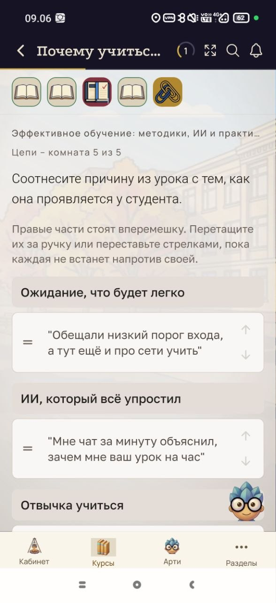

# BUG-009 — В задании типа «Цепи» не найти описанные в инструкции элементы управления

**Краткое описание:** инструкция к заданию ссылается на «правые части» и «ручку» для перетаскивания, но в интерфейсе таких элементов нет

**Окружение:** Android 16, Xiaomi 17; версия приложения не зафиксирована
**Курс:** «Эффективное обучение: методики, ИИ и практика», Цепи — комната 5 из 5
**Severity:** Major
**Priority:** High
**Дата:** 26.09.2026
**Статус:** открыт

---

## Шаги воспроизведения

1. Открыть курс «Эффективное обучение: методики, ИИ и практика»
2. Перейти к заданию «Цепи», комната 5 из 5 — «Соотнесите причину из урока с тем, как она проявляется у студента»
3. Прочитать инструкцию под заголовком задания
4. Найти на экране элементы, которые в ней названы

## Ожидаемый результат

Инструкция описывает элементы теми же словами, какими они подписаны или выглядят в интерфейсе. Пользователю понятно, что перетаскивать и за что.

## Фактический результат

Инструкция гласит: «Правые части стоят вперемешку. Перетащите их за ручку или переставьте стрелками, пока каждая не встанет напротив своей».

На экране при этом:

- Нет ничего, что выглядело бы как «правая часть». Элементы расположены друг под другом в столбик, а не в два столбца слева и справа. Похоже, «правыми частями» названы карточки с цитатами под заголовками, но из текста это не следует.
- Не найден элемент «ручка». Слева от каждой карточки есть значок из двух горизонтальных полос, справа — стрелки вверх и вниз. Ни один из них не подписан.

## Вложения

*Инструкция говорит про «правые части» и «ручку», в интерфейсе столбик карточек со значками без подписей*

## Примечания

Расхождение между языком инструкции и интерфейсом. Формулировка, видимо, написана под расположение в два столбца — такое бывает на широком экране. На телефоне вёрстка перестраивается в один столбец, а текст остаётся прежним.

Значок из двух полос слева, скорее всего, и есть «ручка» для перетаскивания — это распространённое обозначение. Но без подписи и без пояснения в инструкции пользователь его не опознаёт.

## Требует уточнения

Выполняется ли задание в принципе: перетаскивание срабатывает и его просто трудно найти, или элемент не реагирует на удержание. От этого зависит severity — сейчас поставлен Major по факту «пользователь не смог начать выполнение».

Как то же задание выглядит на широком экране. Если там два столбца — подтвердится версия про перестроение вёрстки, и правка сведётся к тексту инструкции для мобильной версии.
