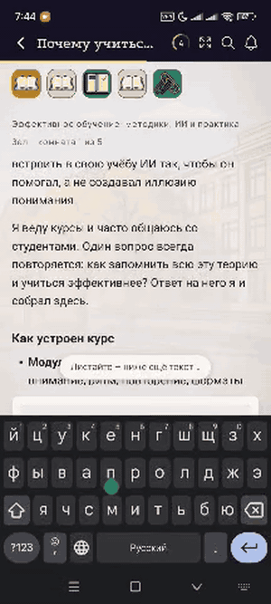

# BUG-010 — Поле заметки к шагу не прокручивается при наборе, текст уходит под клавиатуру

**Краткое описание:** при наборе многострочной заметки содержимое поля не прокручивается автоматически, нижние строки и курсор скрываются за клавиатурой

**Окружение:** Android 16, Xiaomi 17; версия приложения не зафиксирована
**Курс:** «Эффективное обучение: методики, ИИ и практика», Зал — комната 1 из 5
**Severity:** Major
**Priority:** Medium
**Дата:** 26.09.2026
**Статус:** открыт

---

## Шаги воспроизведения

1. Открыть любой шаг курса
2. Нажать на поле «Заметка к шагу» — открывается клавиатура
3. Набрать текст в четыре строки и более
4. Наблюдать за положением курсора и последней набранной строки

## Ожидаемый результат

По мере набора содержимое прокручивается автоматически, курсор и последняя строка остаются в видимой области над клавиатурой.

## Фактический результат

Содержимое не прокручивается. Нижние строки уходят под клавиатуру, курсор не виден. Пользователь набирает текст вслепую и не может перечитать написанное, не закрыв клавиатуру.

## Вложения

*Четыре строки текста, последняя на границе видимой области; прокрутки к курсору не происходит*

## Примечания

Второй дефект того же класса в продукте — см. [BUG-005](BUG-005-arti-keyboard-overlap.md), где клавиатура перекрывает поле ввода в ИИ-помощнике «Арти». Элементы разные, устройства разные (Samsung Galaxy S24 FE и Xiaomi 17), а проблема одна: обработка появления клавиатуры.

Общий корень вероятен: экран не сдвигается и не прокручивается к активному полю при открытии клавиатуры. Имеет смысл посмотреть оба случая вместе, а не чинить по отдельности.

## Предложение

Автоматическая прокрутка к курсору при наборе — стандартное поведение для полей ввода на мобильных. Пользователь сформулировал его сам: «было бы логичным скроллить автоматически».
