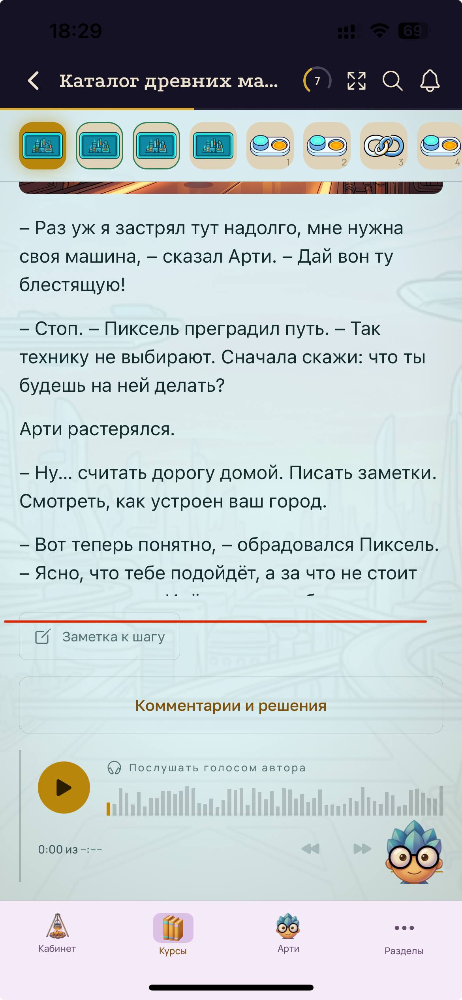

# BUG-011 — Текст шага обрезан, прокрутка и нажатие не работают

**Краткое описание:** содержимое шага отображается не полностью, прокрутка внутри блока не работает, нажатие на текст не даёт реакции; полный текст виден только при повороте телефона в горизонтальное положение

**Окружение:** iOS 18.7.8, iPhone 13; версия приложения не зафиксирована
**Курс:** «Цифровая грамотность с нуля», шаг «Каталог древних машин»
**Severity:** Critical
**Priority:** High
**Дата:** 26.09.2026
**Статус:** открыт

---

## Шаги воспроизведения

1. Открыть курс «Цифровая грамотность с нуля»
2. Перейти к шагу «Каталог древних машин»
3. Держать телефон вертикально
4. Дочитать текст до нижней границы блока
5. Попробовать прокрутить содержимое свайпом вверх
6. Попробовать нажать на текст

## Ожидаемый результат

Текст шага отображается целиком. Если он не помещается — прокручивается вместе со страницей или внутри своего блока.

## Фактический результат

Текст обрывается на середине фразы: «— Ясно, что тебе подойдёт, а за что не стоит…». Следующая строка видна частично, под ней сразу идёт блок «Заметка к шагу».

Свайп по тексту не прокручивает содержимое. Нажатие на текст не разворачивает его и не даёт никакой реакции. Прочитать окончание фрагмента в вертикальной ориентации невозможно.

## Обходной путь

Повернуть телефон в горизонтальное положение — текст отображается полностью.

## Вложения

*Фраза обрывается, под ней сразу «Заметка к шагу»; красная линия показывает границу обрезки*

## Примечания

Блокирующий сценарий для обучения: часть учебного материала недоступна при обычном способе использования. Поворачивать телефон читатель не догадается — ничто на это не указывает.

Обходной путь через горизонтальную ориентацию сужает поиск: в вертикальной вёрстке блок с текстом, видимо, получает фиксированную высоту без прокрутки, а в горизонтальной высота считается иначе.

## Требует проверки

Воспроизводится ли на других шагах этого курса и в других курсах, или проблема только у конкретного шага с длинным текстом.

Воспроизводится ли на Android. Если только на iOS — дефект в мобильной вёрстке под эту платформу.
