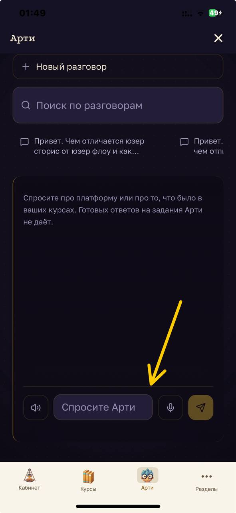
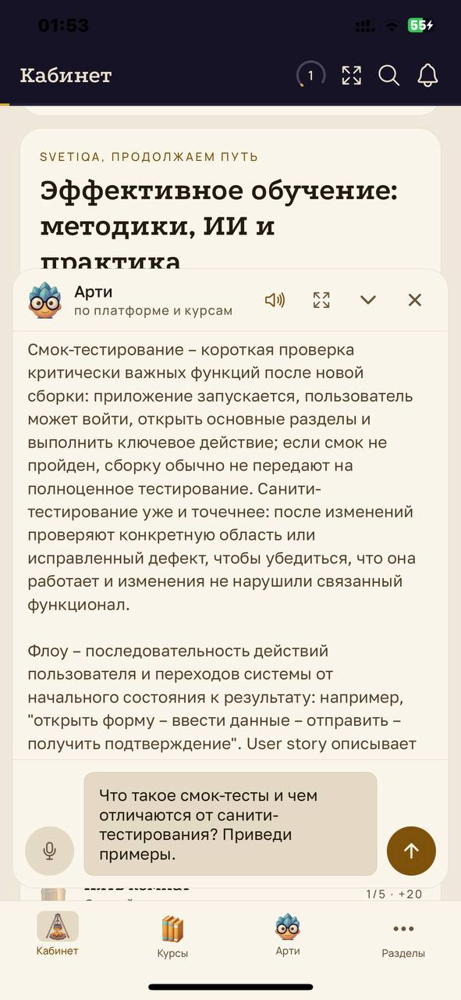

# IMP-001 — Поле ввода в «Арти» не растёт под длинный текст

**Тип:** предложение по улучшению, не дефект
**Окружение:** iOS, тёмная тема интерфейса «Арти»
**Дата:** 24.09.2026

---

## Как сейчас

В окне ИИ-помощника «Арти» поле ввода имеет фиксированную высоту в одну строку. При наборе длинного вопроса текст прокручивается внутри поля, целиком его не видно.

При этом на светлом оформлении окна поле растёт по мере ввода и показывает запрос полностью.

## Вложения

*Тёмное оформление: поле ввода в одну строку, длинный текст прокручивается внутри*

*Светлое оформление: поле растёт по высоте, запрос виден целиком*

## Что предлагается

Привести поведение к одному виду: поле увеличивается по высоте при наборе многострочного текста, с разумным ограничением (например, до 4–5 строк, дальше прокрутка внутри поля).

## Зачем

Вопросы к ИИ-помощнику часто длиннее одной строки. Не видя текст целиком, пользователь не может перечитать и поправить формулировку перед отправкой.

Дополнительный аргумент — консистентность: два оформления одного элемента ведут себя по-разному, и это воспринимается как недоработка, даже если поведение светлой темы считать основным.

## Почему это не баг

Функциональность работает: текст вводится, запрос отправляется, ответ приходит. Требования, которое бы нарушалось, нет. Это вопрос удобства, поэтому severity и priority не проставлены.

## Связанное

[BUG-005](BUG-005-arti-keyboard-overlap.md) — тот же элемент, перекрытие поля клавиатурой на Android. Это уже дефект: там ввод блокируется.
