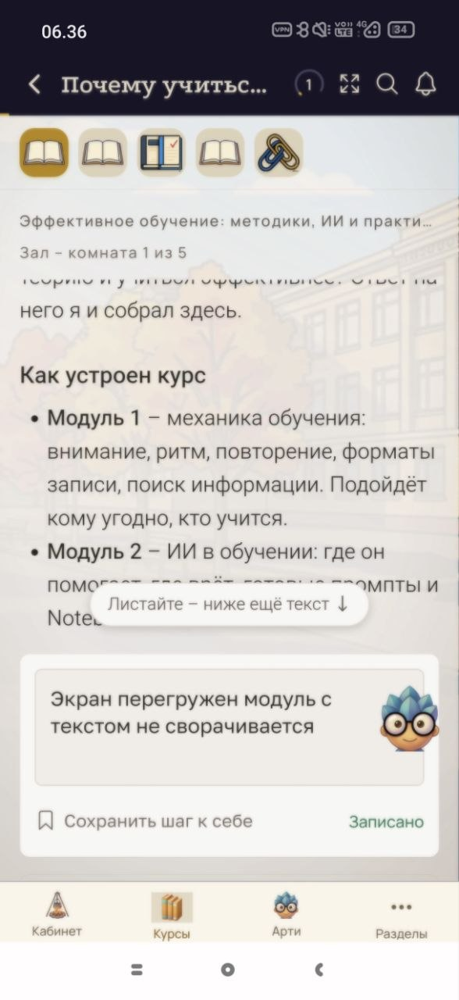

# IMP-002 — Подсказка о прокрутке и блок заметки занимают место на экране

**Тип:** предложение по улучшению, не дефект
**Окружение:** Android 16, Xiaomi 17
**Курс:** «Эффективное обучение: методики, ИИ и практика», Зал — комната 1 из 5
**Дата:** 26.09.2026

---

## Как сейчас

На экране шага одновременно присутствуют два элемента, которые перекрывают учебный текст и не убираются:

**Плашка «Листайте – ниже ещё текст ↓»** висит поверх содержимого и закрывает часть строки. Она остаётся на месте и после того, как пользователь начал прокручивать — то есть после того, как её сообщение перестало быть новостью.

**Блок «Заметка к шагу»** занимает нижнюю часть экрана постоянно, даже когда заметка не пишется и не нужна.

В результате на текст остаётся меньше половины экрана: сверху панель курса и лента шагов, в середине плашка, снизу заметка.

## Что предлагается

Плашку про прокрутку скрывать после первого же свайпа — своё дело она сделала.

Блок заметки сворачивать в компактную строку или иконку, разворачивать по нажатию.

## Зачем

Продукт учебный, основной сценарий — чтение длинного текста. Каждый элемент интерфейса, который висит постоянно, отнимает у текста строки и заставляет прокручивать чаще.

Формулировка пользователя в заметке на скриншоте: «Экран перегружен, модуль с текстом не сворачивается».

## Вложения

*Плашка «Листайте – ниже ещё текст» закрывает строку текста, снизу блок заметки*

## Почему это не баг

Функциональность работает: текст читается, прокрутка идёт, заметка сохраняется. Нарушенного требования нет. Это вопрос плотности интерфейса, поэтому severity и priority не проставлены.
